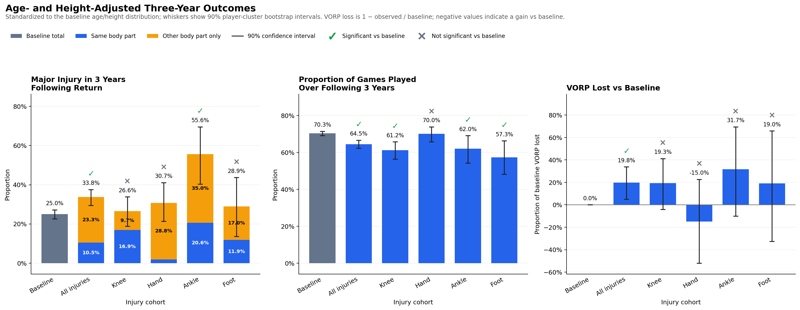
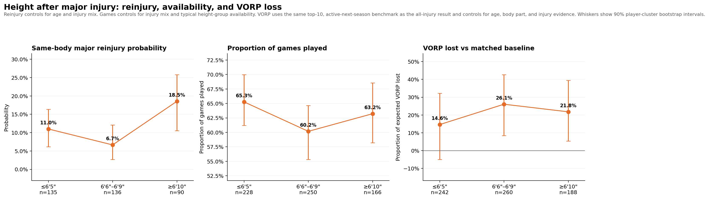
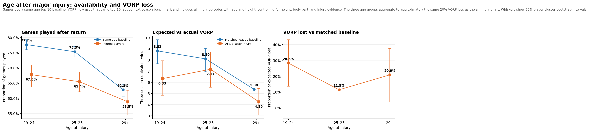

# Valuing NBA Players After Major Injuries

How should NBA front offices value players returning from major injuries? This project evaluates the factors that matter most: recurrence risk, future availability, and retained on-court value.

## Methodology

We evaluate injured players on three outcomes that drive front-office value:

| Metric | Definition | Front-office lens |
|---|---|---|
| Major reinjury risk | Chance of another injury causing at least 30 missed games or ending the season in the first three years after return; same body part unless labeled “any major injury.” | Recurrence risk |
| Games played | Share of available games played in the first three years after confirmed return. | Availability |
| VORP lost | Actual VORP in the first three full seasons back versus an age-adjusted expectation based on prior healthy production. | Retained on-court value |

Expected VORP is the projected path for the same player without the injury, based on prior healthy production and the league's typical aging curve. It is not the performance of a separate comparison player.

## Data acquisition

- [Pro Sports Transactions](https://www.prosportstransactions.com/basketball/Search/Search.php) provides player, team, injury date, and raw injury descriptions.
- [Official NBA team box scores](https://www.nba.com/stats/teams/boxscores) provide game dates and player minutes used to count missed games, confirm returns, and measure post-return availability.
- [Basketball-Reference](https://www.basketball-reference.com/) provides historical schedules, game logs, player biographies, minutes, and VORP.

The full acquisition and merge logic is documented in the [scraping context](context/SCRAPING_CONTEXT.md) and [cleaning context](context/CLEANING_CONTEXT.md).

## Documentation

- [Scraping requirements, sources, methodology, and audits](context/SCRAPING_CONTEXT.md)
- [Cleaning rules, joins, outcome definitions, and regression checks](context/CLEANING_CONTEXT.md)
- [Source-acquisition notebook](notebooks/01_scrape_sources.ipynb)
- [Cleaning and dataset-build notebook](notebooks/02_clean_injuries.ipynb)
- [Recovery and player-value analysis notebook](notebooks/03_analyze_recovery.ipynb)
- [Regression audit cases](data/audits/regression_cases.csv)
- [Analysis-ready episode data](data/analysis/adjusted_multimetric_episode_data.csv)

## Findings

### Type of injury

Confirmed major injuries are followed by about one-third higher subsequent-injury risk, 10% lower availability, and 20% lower VORP. Ankle and foot injuries are the most damaging, while hand surgeries show little decline. For valuation, body part and procedure matter more than the generic “major injury” label; comparisons control for age and height.



### Height and position

Taller players have higher same-body reinjury risk even after controlling for injury type, but their availability and VORP differences are modest and not statistically significant. For valuation, height is a recurrence-risk modifier—not an automatic discount, because the evidence does not show that major injuries reduce big-man performance more than guard performance.



### Age

Once normal age-related availability differences are removed, injuries affect games played similarly across ages. Younger players are significantly more likely to recover their prior value, so age should mainly shape the expected performance rebound—not the availability forecast.



## Repository structure

```text
notebooks/
  01_scrape_sources.ipynb      Acquire and inventory raw source data
  02_clean_injuries.ipynb      Build injury episodes and run cleaning audits
  03_analyze_recovery.ipynb    Reproduce the reinjury, availability, and VORP findings
context/
  SCRAPING_CONTEXT.md          Scraping requirements, sources, methodology, and audits
  CLEANING_CONTEXT.md          Cleaning rules, joins, methodology, and regression checks
src/                           Reusable scraper, builder, and audit scripts
data/analysis/                 Compact analysis inputs and audit extracts
assets/                        README figures
```

## Run the project

```bash
python -m venv .venv
source .venv/bin/activate
pip install -r requirements.txt
jupyter lab
```

Run the notebooks in numeric order. Raw source files are intentionally not committed; the scraping notebook explains how to acquire them and where to place archives that require manual download.

## Audit status and limitations

- The build consolidates 12,165 injury episodes from 2000 through April 2023.
- A 50-case Kaggle cross-check and a 30-case Basketball-Reference audit were used to verify injury descriptions, dates, teams, and return logic.
- Regression checks include Darren Collison (11 games), Isaiah Whitehead (1), and Enes Kanter (10).
- Unknown durations remain unknown rather than being imputed; they are never treated as major injuries.
- Official post-April-2023 injury coverage is incomplete and is not silently merged into the core injury table.
- Results are descriptive associations, not causal estimates. Retirement, roster selection, and small subgroups can affect availability and VORP estimates.

## Future work

- Measure the compounding effect of multiple major injuries.
- Add complete post-2023 injury-report coverage.
- Test stricter same-structure and same-side recurrence definitions.
- Compare injured players with matched, uninjured players.
